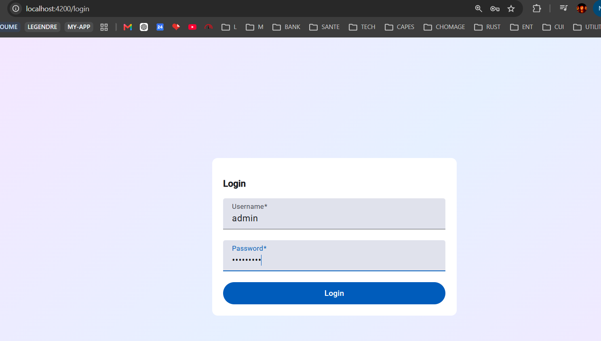

# Collection Manager — An Angular Tutorial App

A small collectibles catalog (coins, stamps, figurines…) built as a hands-on tour of modern
Angular (v22): signal inputs/outputs, fine-grained change detection, the new control-flow
syntax, services, the Router, Reactive Forms, and Angular Material. Collections themselves are
still `localStorage`-backed, but authentication (see [section 9](#9-authentication)) is a real
JWT login flow against `angular-collection-management-backend/`, a small Express + SQLite API.

## Table of contents

- [What it looks like](#what-it-looks-like)
- [Angular features covered](#angular-features-covered)
  - [1. Signal inputs](#1-signal-inputs)
  - [2. Outputs, signal outputs, and `model()`](#2-outputs-signal-outputs-and-model)
  - [3. Change detection: signals + `OnPush`](#3-change-detection-signals--onpush)
  - [4. Loops and conditions — the new control-flow syntax](#4-loops-and-conditions--the-new-control-flow-syntax)
  - [5. Services](#5-services)
  - [6. Routes](#6-routes)
  - [7. Reactive forms](#7-reactive-forms)
  - [8. Angular Material](#8-angular-material)
  - [9. Authentication](#9-authentication)
- [Funky Angular gotchas encountered building this](#funky-angular-gotchas-encountered-building-this)
  - [`withComponentInputBinding()` silently nukes unrelated component inputs](#withcomponentinputbinding-silently-nukes-unrelated-component-inputs)
- [Project structure](#project-structure)
- [Getting started](#getting-started)
- [Testing — two different levels](#testing--two-different-levels)
  - [`ng test` — unit & integration tests](#ng-test--unit--integration-tests-srcappspects)
  - [`npm run e2e` — end-to-end tests](#npm-run-e2e--end-to-end-tests-e2espects)

## What it looks like

**Login — a Reactive Forms page guarding access to the rest of the app:**



**Home — the collection grid, with the authenticated user's nav (avatar, name, collections,
logout) alongside live search and an "Add Item" action:**


**Editing an item — a reactive form with Material fields, live preview card, and a delete
confirmation flow:**


## Angular features covered

Each section below points at the real file and a trimmed excerpt — read the file itself for
the full picture.

### 1. Signal inputs

`input()` replaces the decorator-based `@Input`. It supports an `alias` (to receive a route
param under a different property name) and a `transform` function — used here to safely parse
the route's `:id` string param into a number:

```ts
// src/app/pages/collection-item-detail/collection-item-detail.ts
itemId = input<number | null, string | null>(null, {
  alias: 'id',
  // Explicit radix 10 avoids '0x...' being parsed as hex; NaN (non-numeric id) falls back to null
  transform: (id: string | null) => {
    const parsed = id ? parseInt(id, 10) : NaN;
    return Number.isNaN(parsed) ? null : parsed;
  }
});
```

A required input, with no default and no `| null`, on `CollectionItemCard`:

```ts
// src/app/components/collection-item-card/collection-item-card.ts
item: InputSignal<CollectionItem> = input.required<CollectionItem>();
```

### 2. Outputs, signal outputs, and `model()`

`output()` replaces the decorator-based `@Output`. `ConfirmationDialog` is a fully generic
popup — it knows nothing about *what* it's confirming, just a title, a message, and two
outputs any feature can listen to:

```ts
// src/app/components/confirmation-dialog/confirmation-dialog.ts
@Component({
  selector: 'app-confirmation-dialog',
  imports: [MatButtonModule],
  styleUrl: './confirmation-dialog.scss',
  templateUrl: './confirmation-dialog.html',
})
export class ConfirmationDialog {
  title = input.required<string>();
  message = input.required<string>();
  confirmed = output<void>();
  cancelled = output<void>();
}
```
```html
<!-- src/app/pages/collection-item-detail/collection-item-detail.html -->
@if (showDeleteConfirmation()) {
  <app-confirmation-dialog title="Confirm deletion"
    message="Are you sure you want to delete this object ?"
    (confirmed)="confirmDeletion()" (cancelled)="cancelDeletion()" />
}
```

`model()` combines an input and an output into a single two-way-bindable property — no manual
`@Input`/`@Output` pair needed:

```ts
// src/app/components/search-bar/search-bar.ts
search = model("Initial");
```
```html
<!-- src/app/pages/collection-detail/collection-detail.html -->
<app-search-bar [(search)]="searchText"></app-search-bar>
```

### 3. Change detection: signals + `OnPush`

Instead of Zone.js dirty-checking the whole tree, state lives in signals and components opt in
to `ChangeDetectionStrategy.OnPush` — a view only re-renders when a signal it reads actually
changes:

```ts
// src/app/components/collection-item-card/collection-item-card.ts
@Component({
  imports: [CurrencyPipe],
  selector: 'app-collection-item-card',
  styleUrl: './collection-item-card.scss',
  templateUrl: './collection-item-card.html',
  changeDetection: ChangeDetectionStrategy.OnPush
})
export class CollectionItemCard { /* ... */ }
```

Derived state is expressed with `computed()` (auto-recalculated only when its dependencies
change), and side effects with `effect()`:

```ts
// src/app/pages/collection-detail/collection-detail.ts
selectedCollection = signal<Collection | null>(null);

// Items of the selected collection, filtered by a case-insensitive name match against searchText
collectionItems = computed(() => {
  const allItems = this.selectedCollection()?.items;
  return allItems?.filter(item =>
    item.name.toLowerCase().includes(this.searchText().toLowerCase()));
});
```

```ts
// src/app/pages/collection-item-detail/collection-item-detail.ts
constructor() {
  // Re-runs whenever itemId() changes (i.e. on every /item/:id navigation), since
  // that's the only signal read in this block.
  effect(() => {
    let itemToDisplay = new CollectionItem();
    this.selectedCollection = this.collectionService.getAll()[0];
    if (this.itemId()) {
      const itemFound = this.selectedCollection.items.find(item => item.id === this.itemId());
      itemFound ? (itemToDisplay = itemFound) : this.router.navigate(['not-found']);
    }
    this.itemFormGroup.patchValue(itemToDisplay);
  });
}
```

### 4. Loops and conditions — the new control-flow syntax

`@if`, `@for`, `@switch` and `@let` replace `*ngIf`, `*ngFor`, `[ngSwitch]` — built into the
template compiler, no directive imports needed:

```html
<!-- src/app/pages/collection-detail/collection-detail.html -->
@for (item of collectionItems(); track item.name) {
  @switch (item.rarity) {
    @case ('Legendary') { <div [routerLink]="['/item', item.id]"> ... </div> }
    @case ('Rare')      { <div [routerLink]="['/item', item.id]"> ... </div> }
    @default            { <div [routerLink]="['/item', item.id]"> ... </div> }
  }
}
@let itemCount = collectionItems()?.length;
@if (itemCount) { <div>Found {{itemCount}} items</div> } @else { <div>No item found</div> }
```

### 5. Services

`CollectionService` is the single source of truth for collections and items, injected with
the `inject()` function (no constructor-parameter injection) and backed by `localStorage`
instead of a real API. Every read returns a defensive `copy()` so callers can never mutate
internal state by reference:

```ts
// src/app/pages/collection-item-detail/collection-item-detail.ts
private collectionService = inject(CollectionService);
```

```ts
// src/app/services/collection-service.ts
private save() {
  localStorage.setItem('collections', JSON.stringify(this.collections));
}

getAll(): Collection[] {
  // Return a defensive copy of every collection so callers can't mutate internal state
  return this.collections.map(collection => collection.copy());
}
```

### 6. Routes

A default redirect, nested children sharing one component for both "create" and "edit" modes,
and a catch-all:

```ts
// src/app/app.routes.ts
export const routes: Routes = [
  { path: '', redirectTo: 'home', pathMatch: 'full' },
  { path: 'home', component: CollectionDetail },
  {
    path: 'item',
    children: [
      { path: '', component: CollectionItemDetail },      // create
      { path: ':id', component: CollectionItemDetail },   // edit
    ]
  },
  { path: '**', component: NotFound },
];
```

`withComponentInputBinding()` automatically feeds route params into matching component inputs
(that's how `itemId` gets its value in section 1) — but its default behavior also resets
*every* declared input to `undefined` on each navigation, even ones that were never meant to
be route-bound (like `CollectionDetail.searchText`, a plain `model()` used for local filtering).
`unmatchedInputBehavior: 'undefinedIfStale'` fixes that:

```ts
// src/app/app.config.ts
provideRouter(routes, withComponentInputBinding({ unmatchedInputBehavior: 'undefinedIfStale' }))
```

### 7. Reactive forms

Built with `FormBuilder`, validated with `Validators`, and bound declaratively via
`formControlName` — including a custom `isFieldInvalid` helper for touched/dirty-aware error
display:

```ts
// src/app/pages/collection-item-detail/collection-item-detail.ts
private fb = inject(FormBuilder);
itemFormGroup = this.fb.group({
  name: ['', [Validators.required]],
  description: ['', [Validators.required]],
  image: ['', [Validators.required]],
  rarity: [Rarities.Common as Rarity, [Validators.required]],
  price: [0, [Validators.required, Validators.min(0)]]
});

isFieldInvalid(fieldName: string) {
  const formControl = this.itemFormGroup.get(fieldName);
  return formControl?.invalid && (formControl?.dirty || formControl?.touched);
}
```
```html
<!-- src/app/pages/collection-item-detail/collection-item-detail.html -->
<mat-form-field class="form-field">
  <mat-label for="name">Name : </mat-label>
  <input matInput id="name" name="name" formControlName="name" />
  @if (isFieldInvalid('name')) { <mat-error>This field is required!</mat-error> }
</mat-form-field>
```

### 8. Angular Material

A Material 3 theme is configured once, globally, then components opt in per-feature
(`MatButtonModule`, `MatFormFieldModule`, `MatInputModule`, `MatSelectModule`). A `.danger`
utility class overrides just the color tokens of `matButton` for destructive actions, using the
theme's own system variables:

```scss
// src/styles.scss
@use '@angular/material' as mat;

html {
  @include mat.theme((
    color: (primary: mat.$azure-palette, tertiary: mat.$blue-palette),
    typography: Roboto,
    density: 0,
  ));
}

.danger {
  @include mat.button-overrides((
    filled-container-color: var(--mat-sys-error),
    filled-label-text-color: var(--mat-sys-on-error),
  ));
}
```

### 9. Authentication

A JWT login flow against a real backend (`angular-collection-management-backend/`, a small
Express + SQLite API — see its own `/api-docs` for the full route list), built from four
cooperating pieces: a login page, a service wrapping the auth endpoints, a route guard, and an
HTTP interceptor. None of them know about each other directly — they're stitched together
entirely through `LoginService`'s shared `user` signal and one exported storage-key constant.

> 🔑 To log in, use `admin` / `admin1234` — the only account the backend seeds by default (see
> `angular-collection-management-backend/server.js`).

**The login page** (`src/app/pages/login/login.ts` + `login.html`) is a Reactive Form with two
required controls; the submit button stays disabled until both are filled in:

```ts
loginFormGroup = this.formBuilder.group({
  'username': ['', [Validators.required]],
  'password': ['', [Validators.required]]
});

invalidCredentials = signal(false);
```

`login()` doesn't do the whole job itself — a successful `/login` response only proves the
credentials were right and returns a token, not the user's name. So success there just kicks
off a second request, `getUserInformation()`, before finally navigating:

```ts
login(event: Event) {
  const loginSubscription = this.loginService.login(
    this.loginFormGroup.value as LoginCredentialsDTO
  ).subscribe({
    next: () => this.getUserInformation(),
    error: () => this.invalidCredentials.set(true)
  });
  this.subscriptions.add(loginSubscription);
}

getUserInformation() {
  const getUserSubscription = this.loginService.getUser().subscribe(user => {
    this.navigateHome();
  });
  this.subscriptions.add(getUserSubscription);
}
```

Both requests are collected into one `Subscription` bag (`Subscription.add(...)`) instead of a
separate field per request, so `ngOnDestroy()` can tear all of them down in a single call if the
user navigates away mid-request:

```ts
private subscriptions = new Subscription();
// ...
ngOnDestroy(): void {
  this.subscriptions.unsubscribe();
}
```

**`LoginService`** (`src/app/services/login/login-service.ts`) wraps the three auth endpoints.
Each method returns a *cold* Observable — `http.post`/`http.get` describe the request but don't
send it; nothing happens on the network until a caller `.subscribe()`s:

```ts
login(credentials: LoginCredentialsDTO) {
  return this.http.post(this.BASE_URL + "/login", credentials).pipe(
    tap((result: any) => {
      localStorage.setItem(LK_TOKEN, result['token']);
    })
  );
}
```

`tap()` is a side-effect operator — it runs the callback but re-emits the *same* value
untouched, which is all `login()` needs (save the token, let the raw response continue on).
`getUser()` needs more: it also *transforms* what subscribers receive, via `map()`, and updates
the shared `user` signal that the rest of the app (the nav shell, the guard below) reads
reactively:

```ts
user = signal<User | null | undefined>(undefined);

getUser() {
  return this.http.get(this.BASE_URL + '/me').pipe(
    tap((result: any) => {
      const user = Object.assign(new User(), result);
      this.user.set(user);
    }),
    map(() => this.user())
  );
}
```

`user` deliberately has three states, not two — `undefined` (unknown, never checked) and `null`
(confirmed logged out) are treated differently by the guard below. The storage key itself is
exported as a constant, not repeated as a string, precisely so the interceptor can never drift
out of sync with what this service writes:

```ts
export const LK_TOKEN = 'TOKEN';
```

**`isLoggedInGuard`** (`src/app/guards/is-logged-in/is-logged/is-logged-in-guard.ts`) is a
`CanActivateFn`, registered per-route in `app.routes.ts` — it is not applied globally or
inherited by child routes, so every route that needs protection lists it explicitly:

```ts
// src/app/app.routes.ts
{
  path: 'home',
  component: CollectionDetail,
  canActivate: [isLoggedInGuard]
},
```

The guard's job is entirely driven by which of the three `user` states it currently sees:

```ts
export const isLoggedInGuard: CanActivateFn = (route, state) => {
  const loginService = inject(LoginService);
  const router = inject(Router);

  if (loginService.user() === undefined) {
    // Unknown yet (e.g. a fresh page reload) — ask the server before deciding.
    return loginService.getUser().pipe(
      map(_ => true),
      catchError(_ => of(router.createUrlTree(['login'])))
    )
  }

  if (loginService.user() === null) {
    // Already confirmed logged out (set by logout()) — no need to ask again.
    return router.createUrlTree(['login']);
  }

  return true;
};
```

`undefined` and `null` can't be collapsed into one "no user" check: `undefined` means the answer
is unknown and worth an async round trip to `/me`, while `null` means the answer is already
known for certain, so redirecting synchronously (no wasted request) is enough.

Two details that look minor but change actual behavior: the checks use strict `===`, not `==`
— `null == undefined` is `true` in JS, so a loose check would make the first branch swallow the
second, and the null-specific redirect would never run. And redirecting means *returning* a
`UrlTree` (`router.createUrlTree([...])`), not imperatively calling `router.navigate([...])` and
returning `true`/its resolved boolean — the latter tells the router two contradictory things at
once ("go to /login" and "yes, activate the originally guarded route").

**`authTokenInterceptor`** (`src/app/interceptors/auth-token/auth-token-interceptor.ts`) is a
functional `HttpInterceptorFn` — the mechanism that actually gets the stored token onto every
outgoing request, without any component or service having to remember to attach it manually:

```ts
export const authTokenInterceptor: HttpInterceptorFn = (req, next) => {
  const token = localStorage.getItem(LK_TOKEN);
  let requestToSend = req;
  if (token) {
    const headers = req.headers.set('Authorization', 'Bearer ' + token);
    requestToSend = req.clone({ headers });
  }
  return next(requestToSend);
};
```

`HttpRequest` is immutable, so attaching a header means building a new `HttpHeaders` (`.set()`
returns a copy) and a new request carrying it (`.clone()`), rather than mutating `req` in place.
An interceptor function is inert on its own, though — it only runs because it's registered:

```ts
// src/app/app.config.ts
provideHttpClient(withInterceptors([authTokenInterceptor]))
```

## Funky Angular gotchas encountered building this

Real dev-time surprises worth remembering, so they don't have to be rediscovered.

### `withComponentInputBinding()` silently nukes unrelated component inputs

**Symptom:** `CollectionDetail` rendered its header, search bar and "Add Item" button just
fine — but the item grid was always empty, with a console error:
`TypeError: Cannot read properties of undefined (reading 'toLowerCase')` inside the
`collectionItems` computed, on `this.searchText().toLowerCase()`.

**Why:** `searchText = model('')` is meant purely as local, two-way-bound state shared with
`<app-search-bar>` — it was never supposed to be fed by the router. But `model()` also
registers a real `@Input()`/`@Output()` pair on the *component itself*, and this component is
routed with `withComponentInputBinding()` enabled (needed elsewhere, so `CollectionItemDetail`
can receive its `:id` route param as an input — see the Routes section above).

The router feature's default `unmatchedInputBehavior` is `'alwaysUndefined'`: on every route
activation, it iterates over *every* input declared on the routed component and force-sets any
input with no matching route param/query param/data key to `undefined` — even one that was
never meant to be route-bound. Since there's no `searchText` key anywhere in the route data,
the router was explicitly resetting it to `undefined` right after the component initialized,
which then blew up the first signal read inside `collectionItems()`.

**Fix:**

```ts
// src/app/app.config.ts
provideRouter(routes, withComponentInputBinding({ unmatchedInputBehavior: 'undefinedIfStale' }))
```

`'undefinedIfStale'` only clears an input if it was *previously* populated by route data (i.e.
genuinely gone stale) — inputs like `searchText` that were never route-bound in the first place
are left alone, while `CollectionItemDetail.itemId` still gets set correctly from `:id` since
that one *does* have a matching route param. It's official, stable `@publicApi` — not a
workaround — documented for exactly this conflict between "auto-bind route data to inputs" and
"component also has its own signal-based state".

## Project structure

```
src/app/
├── components/           # Reusable, presentation-only pieces
│   ├── search-bar/
│   ├── collection-item-card/
│   └── confirmation-dialog/
├── pages/                # Routed views
│   ├── collection-detail/       (the grid, "/home")
│   ├── collection-item-detail/  (create/edit form, "/item" and "/item/:id")
│   ├── login/                   (Reactive Form login page, "/login")
│   └── not-found/
├── models/               # Plain data classes (Collection, CollectionItem, Rarity, User)
├── services/
│   ├── collection/       # CollectionService (localStorage-backed persistence)
│   └── login/            # LoginService (JWT login/getUser/logout against the real backend)
├── guards/
│   └── is-logged-in/     # isLoggedInGuard — CanActivateFn protecting authenticated routes
├── interceptors/
│   └── auth-token/       # authTokenInterceptor — attaches the stored JWT to every request
├── app.ts / app.html      # Root shell: user nav (avatar, collections, logout) + <router-outlet>
├── app.routes.ts
└── app.config.ts
```

This layout is a flat, type-based split (`components/`, `pages/`, `models/`, `services/`) — it
does **not** follow a
[feature-based Angular architecture](https://blog.nashtechglobal.com/feature-based-angular-architecture-modular-design-for-scalable-applications/)
(e.g. grouping each feature's component, service, model and routes together in its own folder).
That's a deliberate choice for a training app this small: the goal here is to keep the focus on
Angular programming concepts themselves, not on demonstrating a scalable folder structure. A
real, larger application would likely benefit from organizing by feature instead.

## Getting started

Authentication (see [section 9](#9-authentication)) needs the real backend running — start
`angular-collection-management-backend/` first (`docker-compose up`, or `npm install && node
server.js`), then the frontend:

```bash
npm install
ng serve
```

Open `http://localhost:4200/` — the app reloads automatically as you edit source files. Log in
with `admin` / `admin1234`, the account the backend seeds by default.

```bash
ng build   # production build, output in dist/
ng test    # unit / integration tests (Vitest)
npm run e2e  # end-to-end tests (Playwright) — starts its own dev server automatically
```

## Testing — two different levels

This project has two separate test suites, at two different levels. Both matter, and they
catch different kinds of bugs.

### `ng test` — unit & integration tests (`src/app/**/*.spec.ts`)

These run inside Angular's `TestBed`, in Node (via `jsdom`, no real browser) — fast, and no
need to have the app running first.

- A **unit test** exercises one piece in isolation (e.g.
  `src/app/services/collection-service.spec.ts` just checks the service gets created).
- An **integration test** renders a real component together with its *real* dependencies —
  child components, the real `CollectionService` (backed by a real, cleared `localStorage`),
  the real `Router` — to check that they actually work *together*, not just individually. See
  `src/app/pages/collection-detail/collection-detail.spec.ts` (renders the grid + search bar
  together, types into the real search input, checks the real filtered output) and
  `src/app/pages/collection-item-detail/collection-item-detail.spec.ts` (uses
  `RouterTestingHarness` to drive the real route config from `app.routes.ts`, so the component
  receives its `:id` input exactly the way it does in the running app).

These tests actually caught a real bug while being written: `CollectionService.generateDummyData()`
used to rely on `CollectionItem`'s default field values for its third sample item, with a
comment claiming that's what gives it its "Linx" identity — but once those defaults were
changed elsewhere (to serve as a blank starting point for the "create new item" form), that
comment silently went stale, and the seeded item quietly became blank. The integration test
asserting on the three seeded item names caught it immediately.

### `npm run e2e` — end-to-end tests (`e2e/*.spec.ts`)

These use [Playwright](https://playwright.dev) to drive a **real, running instance of the app
in a real browser** — exactly as a user would click through it. `playwright.config.ts` starts
`ng serve` automatically if it isn't already running.

`e2e/collection-manager.spec.ts` walks through the actual user flows: seeing the seeded items,
searching, creating a new item (including uploading a file for the image field), cancelling an
edit, and both outcomes of the delete-confirmation popup (Yes / No).

**Why both?** The integration tests are fast and precise about *what broke* (which component,
which method) but never touch a real browser. The e2e tests are slower, but are the only ones
that prove the whole thing — HTML, CSS, routing, the Material components, real click/type
events — actually works end to end, the same way a real user would experience it.
