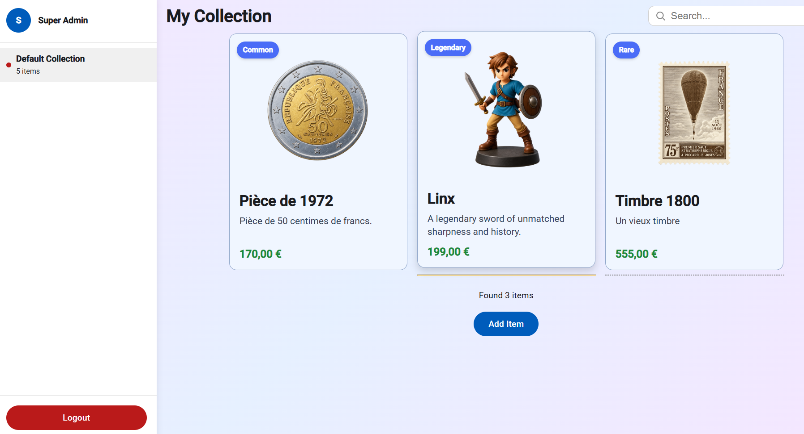
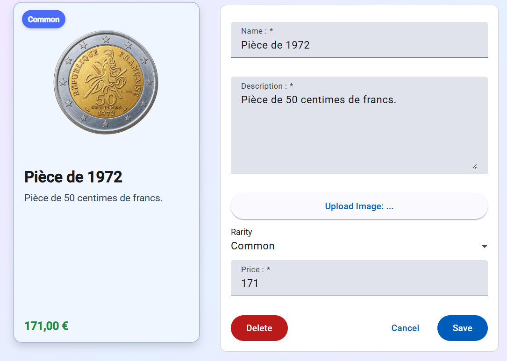

# Collection Manager — An Angular Tutorial App

A small collectibles catalog (coins, stamps, figurines…) built as a hands-on tour of modern
Angular (v22): signal inputs/outputs, fine-grained change detection, the new control-flow
syntax, services, the Router, Reactive Forms, and Angular Material — with no backend, just
`localStorage`.

> 📸 To make the screenshots below render, save your two reference screenshots as
> `docs/screenshots/home.png` (the grid view) and `docs/screenshots/item-form.png`
> (the item edit form) — the folder already exists, empty, waiting for them.

## What it looks like

**Home — the collection grid, with live search and an "Add Item" action:**



**Editing an item — a reactive form with Material fields, live preview card, and a delete
confirmation flow:**



## Angular features covered

Each section below points at the real file and a trimmed excerpt — read the file itself for
the full picture.

### 1. Signal inputs

`input()` replaces the decorator-based `@Input`. It supports an `alias` (to receive a route
param under a different property name) and a `transform` function — used here to safely parse
the route's `:id` string param into a number:

```ts
// src/app/pages/collection-item-detail/collection-item-detail.ts
itemId = input<number | null, string | null>(null, {
  alias: 'id',
  // Explicit radix 10 avoids '0x...' being parsed as hex; NaN (non-numeric id) falls back to null
  transform: (id: string | null) => {
    const parsed = id ? parseInt(id, 10) : NaN;
    return Number.isNaN(parsed) ? null : parsed;
  }
});
```

A required input, with no default and no `| null`, on `CollectionItemCard`:

```ts
// src/app/components/collection-item-card/collection-item-card.ts
item: InputSignal<CollectionItem> = input.required<CollectionItem>();
```

### 2. Outputs, signal outputs, and `model()`

`output()` replaces the decorator-based `@Output`. `ConfirmationDialog` is a fully generic
popup — it knows nothing about *what* it's confirming, just a title, a message, and two
outputs any feature can listen to:

```ts
// src/app/components/confirmation-dialog/confirmation-dialog.ts
@Component({
  selector: 'app-confirmation-dialog',
  imports: [MatButtonModule],
  styleUrl: './confirmation-dialog.scss',
  templateUrl: './confirmation-dialog.html',
})
export class ConfirmationDialog {
  title = input.required<string>();
  message = input.required<string>();
  confirmed = output<void>();
  cancelled = output<void>();
}
```
```html
<!-- src/app/pages/collection-item-detail/collection-item-detail.html -->
@if (showDeleteConfirmation()) {
  <app-confirmation-dialog title="Confirm deletion"
    message="Are you sure you want to delete this object ?"
    (confirmed)="confirmDeletion()" (cancelled)="cancelDeletion()" />
}
```

`model()` combines an input and an output into a single two-way-bindable property — no manual
`@Input`/`@Output` pair needed:

```ts
// src/app/components/search-bar/search-bar.ts
search = model("Initial");
```
```html
<!-- src/app/pages/collection-detail/collection-detail.html -->
<app-search-bar [(search)]="searchText"></app-search-bar>
```

### 3. Change detection: signals + `OnPush`

Instead of Zone.js dirty-checking the whole tree, state lives in signals and components opt in
to `ChangeDetectionStrategy.OnPush` — a view only re-renders when a signal it reads actually
changes:

```ts
// src/app/components/collection-item-card/collection-item-card.ts
@Component({
  imports: [CurrencyPipe],
  selector: 'app-collection-item-card',
  styleUrl: './collection-item-card.scss',
  templateUrl: './collection-item-card.html',
  changeDetection: ChangeDetectionStrategy.OnPush
})
export class CollectionItemCard { /* ... */ }
```

Derived state is expressed with `computed()` (auto-recalculated only when its dependencies
change), and side effects with `effect()`:

```ts
// src/app/pages/collection-detail/collection-detail.ts
selectedCollection = signal<Collection | null>(null);

// Items of the selected collection, filtered by a case-insensitive name match against searchText
collectionItems = computed(() => {
  const allItems = this.selectedCollection()?.items;
  return allItems?.filter(item =>
    item.name.toLowerCase().includes(this.searchText().toLowerCase()));
});
```

```ts
// src/app/pages/collection-item-detail/collection-item-detail.ts
constructor() {
  // Re-runs whenever itemId() changes (i.e. on every /item/:id navigation), since
  // that's the only signal read in this block.
  effect(() => {
    let itemToDisplay = new CollectionItem();
    this.selectedCollection = this.collectionService.getAll()[0];
    if (this.itemId()) {
      const itemFound = this.selectedCollection.items.find(item => item.id === this.itemId());
      itemFound ? (itemToDisplay = itemFound) : this.router.navigate(['not-found']);
    }
    this.itemFormGroup.patchValue(itemToDisplay);
  });
}
```

### 4. Loops and conditions — the new control-flow syntax

`@if`, `@for`, `@switch` and `@let` replace `*ngIf`, `*ngFor`, `[ngSwitch]` — built into the
template compiler, no directive imports needed:

```html
<!-- src/app/pages/collection-detail/collection-detail.html -->
@for (item of collectionItems(); track item.name) {
  @switch (item.rarity) {
    @case ('Legendary') { <div [routerLink]="['/item', item.id]"> ... </div> }
    @case ('Rare')      { <div [routerLink]="['/item', item.id]"> ... </div> }
    @default            { <div [routerLink]="['/item', item.id]"> ... </div> }
  }
}
@let itemCount = collectionItems()?.length;
@if (itemCount) { <div>Found {{itemCount}} items</div> } @else { <div>No item found</div> }
```

### 5. Services

`CollectionService` is the single source of truth for collections and items, injected with
the `inject()` function (no constructor-parameter injection) and backed by `localStorage`
instead of a real API. Every read returns a defensive `copy()` so callers can never mutate
internal state by reference:

```ts
// src/app/pages/collection-item-detail/collection-item-detail.ts
private collectionService = inject(CollectionService);
```

```ts
// src/app/services/collection-service.ts
private save() {
  localStorage.setItem('collections', JSON.stringify(this.collections));
}

getAll(): Collection[] {
  // Return a defensive copy of every collection so callers can't mutate internal state
  return this.collections.map(collection => collection.copy());
}
```

### 6. Routes

A default redirect, nested children sharing one component for both "create" and "edit" modes,
and a catch-all:

```ts
// src/app/app.routes.ts
export const routes: Routes = [
  { path: '', redirectTo: 'home', pathMatch: 'full' },
  { path: 'home', component: CollectionDetail },
  {
    path: 'item',
    children: [
      { path: '', component: CollectionItemDetail },      // create
      { path: ':id', component: CollectionItemDetail },   // edit
    ]
  },
  { path: '**', component: NotFound },
];
```

`withComponentInputBinding()` automatically feeds route params into matching component inputs
(that's how `itemId` gets its value in section 1) — but its default behavior also resets
*every* declared input to `undefined` on each navigation, even ones that were never meant to
be route-bound (like `CollectionDetail.searchText`, a plain `model()` used for local filtering).
`unmatchedInputBehavior: 'undefinedIfStale'` fixes that:

```ts
// src/app/app.config.ts
provideRouter(routes, withComponentInputBinding({ unmatchedInputBehavior: 'undefinedIfStale' }))
```

### 7. Reactive forms

Built with `FormBuilder`, validated with `Validators`, and bound declaratively via
`formControlName` — including a custom `isFieldInvalid` helper for touched/dirty-aware error
display:

```ts
// src/app/pages/collection-item-detail/collection-item-detail.ts
private fb = inject(FormBuilder);
itemFormGroup = this.fb.group({
  name: ['', [Validators.required]],
  description: ['', [Validators.required]],
  image: ['', [Validators.required]],
  rarity: [Rarities.Common as Rarity, [Validators.required]],
  price: [0, [Validators.required, Validators.min(0)]]
});

isFieldInvalid(fieldName: string) {
  const formControl = this.itemFormGroup.get(fieldName);
  return formControl?.invalid && (formControl?.dirty || formControl?.touched);
}
```
```html
<!-- src/app/pages/collection-item-detail/collection-item-detail.html -->
<mat-form-field class="form-field">
  <mat-label for="name">Name : </mat-label>
  <input matInput id="name" name="name" formControlName="name" />
  @if (isFieldInvalid('name')) { <mat-error>This field is required!</mat-error> }
</mat-form-field>
```

### 8. Angular Material

A Material 3 theme is configured once, globally, then components opt in per-feature
(`MatButtonModule`, `MatFormFieldModule`, `MatInputModule`, `MatSelectModule`). A `.danger`
utility class overrides just the color tokens of `matButton` for destructive actions, using the
theme's own system variables:

```scss
// src/styles.scss
@use '@angular/material' as mat;

html {
  @include mat.theme((
    color: (primary: mat.$azure-palette, tertiary: mat.$blue-palette),
    typography: Roboto,
    density: 0,
  ));
}

.danger {
  @include mat.button-overrides((
    filled-container-color: var(--mat-sys-error),
    filled-label-text-color: var(--mat-sys-on-error),
  ));
}
```

## Funky Angular gotchas encountered building this

Real dev-time surprises worth remembering, so they don't have to be rediscovered.

### `withComponentInputBinding()` silently nukes unrelated component inputs

**Symptom:** `CollectionDetail` rendered its header, search bar and "Add Item" button just
fine — but the item grid was always empty, with a console error:
`TypeError: Cannot read properties of undefined (reading 'toLowerCase')` inside the
`collectionItems` computed, on `this.searchText().toLowerCase()`.

**Why:** `searchText = model('')` is meant purely as local, two-way-bound state shared with
`<app-search-bar>` — it was never supposed to be fed by the router. But `model()` also
registers a real `@Input()`/`@Output()` pair on the *component itself*, and this component is
routed with `withComponentInputBinding()` enabled (needed elsewhere, so `CollectionItemDetail`
can receive its `:id` route param as an input — see the Routes section above).

The router feature's default `unmatchedInputBehavior` is `'alwaysUndefined'`: on every route
activation, it iterates over *every* input declared on the routed component and force-sets any
input with no matching route param/query param/data key to `undefined` — even one that was
never meant to be route-bound. Since there's no `searchText` key anywhere in the route data,
the router was explicitly resetting it to `undefined` right after the component initialized,
which then blew up the first signal read inside `collectionItems()`.

**Fix:**

```ts
// src/app/app.config.ts
provideRouter(routes, withComponentInputBinding({ unmatchedInputBehavior: 'undefinedIfStale' }))
```

`'undefinedIfStale'` only clears an input if it was *previously* populated by route data (i.e.
genuinely gone stale) — inputs like `searchText` that were never route-bound in the first place
are left alone, while `CollectionItemDetail.itemId` still gets set correctly from `:id` since
that one *does* have a matching route param. It's official, stable `@publicApi` — not a
workaround — documented for exactly this conflict between "auto-bind route data to inputs" and
"component also has its own signal-based state".

## Project structure

```
src/app/
├── components/           # Reusable, presentation-only pieces
│   ├── search-bar/
│   ├── collection-item-card/
│   └── confirmation-dialog/
├── pages/                # Routed views
│   ├── collection-detail/       (the grid, "/home")
│   ├── collection-item-detail/  (create/edit form, "/item" and "/item/:id")
│   └── not-found/
├── models/               # Plain data classes (Collection, CollectionItem, Rarity)
├── services/             # CollectionService (localStorage-backed persistence)
├── app.routes.ts
└── app.config.ts
```

## Getting started

```bash
npm install
ng serve
```

Open `http://localhost:4200/` — the app reloads automatically as you edit source files.

```bash
ng build   # production build, output in dist/
ng test    # unit tests (Vitest)
```
